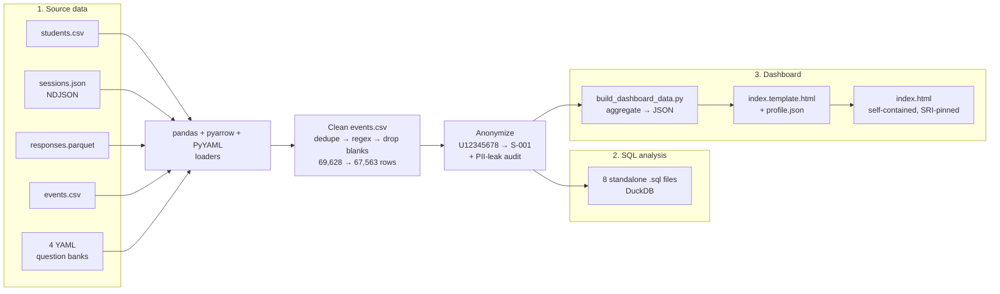

<div align="center">

# Learning Analytics: SQL + Dashboard

**8 DuckDB SQL queries on 19,608 student responses, presented as a self-contained dashboard.**

[SQL queries](2_sql_analysis/) · [Dashboard source](3_dashboard/index.html)

520 learners · 1,832 sessions · 19,608 responses · 4 technical assessment domains

</div>

---

## What this is

A self-directed analytics project. I took a class assessment dataset of 520 students and 19,608 responses across four technical subjects (Python Fundamentals, Pandas Core, SQL with DuckDB, Data Visualization), wrote **8 DuckDB SQL queries** to answer specific questions about how students performed, then built a single-file HTML dashboard so the findings are readable in 30 seconds without running any code.

The repo is in three numbered folders so you can read it in order: **data → SQL → dashboard.**

```
.
├── 1_data/             What I worked with. Anonymized datasets + question banks.
├── 2_sql_analysis/     The work. 8 standalone DuckDB SQL files, one per question.
└── 3_dashboard/        The result. A single static HTML dashboard.
```

---

## Featured SQL: top 3 students per domain (window function)

The query I am most proud of. Without a window function, I would need four separate queries (one per domain) and a `UNION`. With `RANK() OVER (PARTITION BY domain ORDER BY ... DESC)` it is one query.

DuckDB lets me query CSV and Parquet files directly, so there is no `CREATE TABLE` setup step. Just point at the files and join.

```sql
WITH ranked AS (
    SELECT
        q.domain,
        s.student_id,
        AVG(CAST(r.is_correct AS INT))                                   AS accuracy,
        RANK() OVER (
            PARTITION BY q.domain
            ORDER BY AVG(CAST(r.is_correct AS INT)) DESC
        )                                                                AS domain_rank
    FROM read_parquet('1_data/responses.parquet') r
    JOIN read_csv_auto('1_data/students.csv')     s ON r.student_id  = s.student_id
    JOIN read_csv_auto('1_data/questions.csv')    q ON r.question_id = q.question_id
    WHERE r.is_correct IS NOT NULL
    GROUP BY q.domain, s.student_id
    HAVING COUNT(*) >= 5            -- minimum sample size per student per domain
)
SELECT domain, student_id, accuracy, domain_rank
FROM ranked
WHERE domain_rank <= 3
ORDER BY domain, domain_rank;
```

Full file with comments: [`2_sql_analysis/06_top_performers_window_function.sql`](2_sql_analysis/06_top_performers_window_function.sql)

---

## What I found

Five things came out of the analysis. Number 3 is the one I didn't expect.

**1. The difficulty levels are calibrated correctly.**
Mean accuracy is 69.9% on D1, 69.0% on D2, 67.8% on D3. A 2.1-point drop across three difficulty steps means D1 → D3 is doing real work. Not so steep that nobody finishes the hard ones, not so flat that difficulty doesn't matter.
[`03_accuracy_by_difficulty.sql`](2_sql_analysis/03_accuracy_by_difficulty.sql)

**2. Response time is highest on the first question, then drops.**
Classic learning-curve shape. Students take longer on Q1 because they're getting used to the platform, then they speed up. If I cared about average completion time, I'd throw away the Q1 readings to get a cleaner number.
[`07_response_time_by_sequence_position.sql`](2_sql_analysis/07_response_time_by_sequence_position.sql)

**3. Wrong answers do not take less time than right answers.**
This was the surprise. I expected wrong answers to be faster (rushing) or much slower (struggling). But mean response time is 52-54s on both correct and incorrect answers, across all four subjects. So wrong answers are not a pacing problem. They're a content gap. For a teacher, that changes what to fix.
[`08_response_time_vs_correctness.sql`](2_sql_analysis/08_response_time_vs_correctness.sql)

**4. About half the cohort finishes the full curriculum.**
248 of 520 students completed all four domains, which is 47.7%. The other 52.3% completed 1, 2, or 3 domains. That's either a problem to fix (where do people drop off?) or a feature of self-paced learning (47.7% completion is not bad).
[`05_completers_all_four_domains.sql`](2_sql_analysis/05_completers_all_four_domains.sql)

**5. 9.3% of sessions get abandoned, evenly across the four subjects.**
No single domain is the cause. So the abandonment isn't "SQL is too hard" or "data viz is boring." It's something about format, timing, or motivation that applies to all four.
[`02_domain_coverage.sql`](2_sql_analysis/02_domain_coverage.sql)

---

## How the data flows



---

## What I learned

Six things I picked up doing this. Briefly.

**1. Real data is never clean.**
CSV, NDJSON, Parquet, YAML. Four files, four different loaders, four different shapes. The events file had duplicates and malformed IDs. The sessions JSON had nested metadata I had to flatten. None of these were ready to join straight from disk.

**2. Window functions replace UNIONs.**
`RANK() OVER (PARTITION BY domain ORDER BY accuracy DESC)` gives me the top 3 per domain in one query. Without it, I'd write four separate queries, one per domain, then UNION them together. Shorter to read and faster to run.
See [`06_top_performers_window_function.sql`](2_sql_analysis/06_top_performers_window_function.sql).

**3. HAVING is for groups, WHERE is for rows.**
"Students who completed all four domains" is a property of the group of rows, not of any single row. So it has to go in HAVING after the GROUP BY, not in WHERE.
See [`05_completers_all_four_domains.sql`](2_sql_analysis/05_completers_all_four_domains.sql).

**4. Right-skewed data needs log bins.**
I tried a linear histogram of response times first. 95% of the bar was in one tall column on the left. Log-spaced bins fixed it without changing any data. Same data, completely different chart.

**5. Anonymizing PII is not one regex.**
First pass replaces real student IDs with `S-001`, `S-002`, etc. Second pass catches malformed IDs in the raw events file (a real ID with extra characters appended, e.g. `U12345678X`) that embed real IDs as substrings. The PII audit only passed after both passes ran.

**6. Build pipelines beat hand-edits.**
The dashboard is a template HTML, a build script, and a JSON data file. Running the script regenerates `index.html`. If I hand-edited the dashboard every time the data changed, I'd be patching it forever and it would drift from the source.

---

## Skills + tech stack

| Layer | Tools |
|---|---|
| Data formats | CSV, NDJSON, Parquet, YAML (~70k events, 19,608 responses) |
| ETL | Python 3.10, pandas, pyarrow, PyYAML |
| SQL | DuckDB (CTEs, multi-way JOINs, GROUP BY + HAVING, RANK() OVER PARTITION BY, regex) |
| Frontend | HTML, CSS, vanilla JavaScript, Chart.js 4.4.4 (CDN-pinned with SRI) |
| Privacy | Deterministic ID mapping, automated PII-leak audit |

---

## Run locally

```bash
# 1. Open the dashboard immediately
open 3_dashboard/index.html

# 2. Run any SQL query against the anonymized data in 1_data/
duckdb < 2_sql_analysis/06_top_performers_window_function.sql

# 3. Run all 8 queries
cd 2_sql_analysis && ./run_all.sh
```

DuckDB CLI install: https://duckdb.org/docs/installation/

The build script (`3_dashboard/build_dashboard_data.py`) is included as a reference for the cleaning + anonymization pipeline. It reads from the original source data (`data/` and `question_banks/`) which is not redistributed here because it contains PII. The anonymized derivatives in `1_data/` are the output of running it.

---

## Privacy & security notes

- **No personally identifying information is ever committed.** A deterministic mapping replaces every `student_id`, `uniqname`, name, and email with portfolio-safe pseudonyms before any output file is written. Malformed IDs that embed real IDs as substrings get a separate `INVALID-NNN` mapping. An automated audit verifies zero leakage across all 21 committed files.
- **Subresource Integrity (SRI)** locks the Chart.js dependency to a specific SHA-384 hash. The browser refuses to execute tampered bytes from the CDN.
- All dynamic strings rendered into the dashboard go through HTML-escaping. Inline JSON inside `<script>` is `</`-escaped to prevent script-tag breakout. External links use `rel="noopener noreferrer"`.

---

## Contact

**Celine Darvas**
[ceiliine@umich.edu](mailto:ceiliine@umich.edu)

## License

MIT, see [`LICENSE`](LICENSE). The dataset is a synthetic class-assignment dataset. Only its anonymized derivatives are redistributed here.
